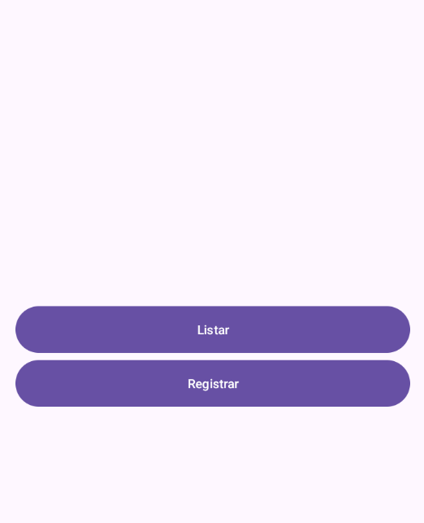
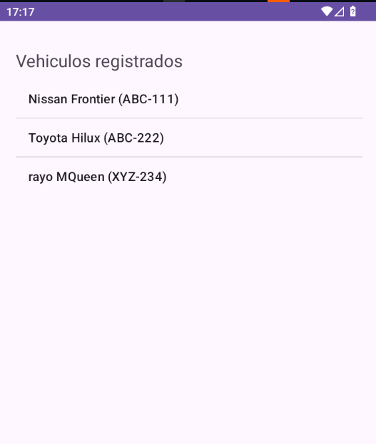
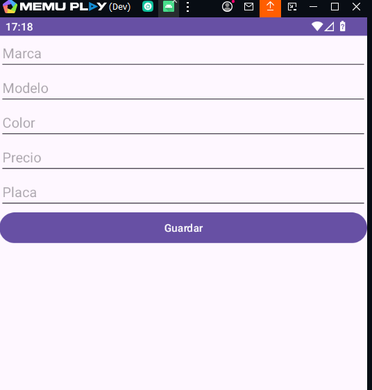
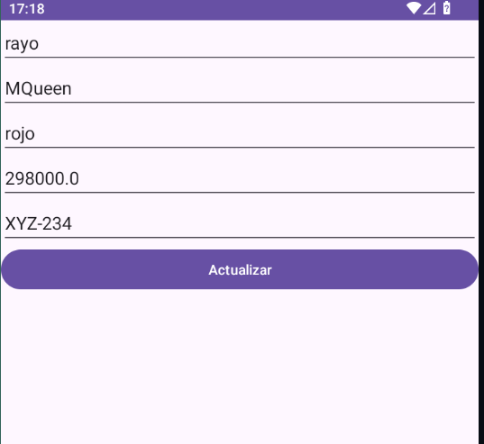
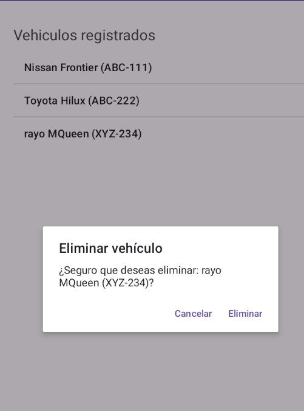

# 📱 App Tienda de Vehículos – Android (Java + Volley)

Aplicación móvil simple para **gestionar vehículos** consumiendo un backend REST. Construida con **Android (Java 11)** y **Volley** para las peticiones HTTP.
### 🤳[Puede descargar el apk aquí](https://github.com/DanteLuque/appmobile-java-tiendaveh/releases/tag/v1.0.0)

## ✨ Características

-   **CRUD completo** de vehículos: listar, crear, editar y eliminar (con confirmación).
-   **Validación de campos** y mensajes de error con _Toast_.
-   **Manejo de red** con `Volley` + `RetryPolicy` (reintentos y timeout).
-   **Configurable** para apuntar a entorno **dev** o **prod** desde un solo archivo.
-   Compatible desde **Android 10 (API 29)**

## 📦 Requisitos de desarrollo

-   **Android Studio**
-   **JDK 11**
-   Un backend disponible (por ejemplo, el CRUD de vehículos en Node/Express).

## ⚙️ Configuración del backend
Cambia entre **DEV** y **PROD** editando `Config.java`:
```java
public class Config {
    private static final String URL_DEV = "http://192.168.56.1:3001/api/v1";
    private static final String URL_PROD = "https://tu-dominio-backend/api/v1";
    private static final boolean USE_PROD = true; // true=PROD, false=DEV

    public static String getBaseUrl() { return USE_PROD ? URL_PROD : URL_DEV; }
```
>**Nota:** el `AndroidManifest.xml` incluye el permiso **INTERNET** y `usesCleartextTraffic="true"` para permitir HTTP en desarrollo

## 📲 Uso de la app (flujo rápido)
-   **Pantalla principal:** botones _Listar_ y _Registrar_.
-   **Listar:**
    -   **Toque corto** sobre un ítem → abre el formulario con los datos **prellenados** para **editar**. (El flujo de edición ya usa `PATCH` cuando `isEdit` es verdadero).
    -   **Mantener pulsado** sobre un ítem → aparece un **diálogo de confirmación** para **eliminar** (si lo implementaste con long-press como acordamos).
-   **Registrar/Editar:**
    -   Si entras desde _Registrar_, el botón dice **Guardar** (crea via `POST`).
    -   Si entras desde _Listar_ (toque corto), verás los campos **prellenados** y el botón dice **Actualizar** (`PATCH`).

## 📁 Estructura del proyecto
``` 
app/
├─ src/main/
│  ├─ AndroidManifest.xml
│  ├─ java/com/senati/apptiendavehiculos/
│  │  ├─ MainActivity.java          # Menú principal
│  │  ├─ Listar.java                # Lista + editar (tap) / eliminar (long press)
│  │  ├─ Registrar.java             # Crear/Actualizar
│  │  ├─ Vehiculo.java              # Modelo (Serializable)
│  │  └─ config/Config.java         # URLs del backend (DEV/PROD)
│  └─ res/…
```

## 🖼️ Interfaz
<table>
  <tr>
    <td></td>
    <td></td>
  </tr>
  <tr>
    <td></td>
    <td></td>
  </tr>
  <tr>
    <td colspan="2" align="center">
      
    </td>
  </tr>
</table>